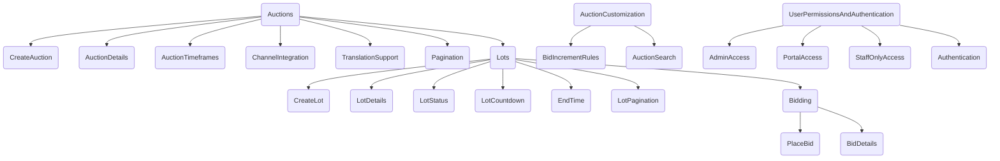

**Reusable Features:**

1. **User Authentication and Permissions:** The existing user authentication and permission mechanisms can be reused to ensure secure access to the auction platform.
    
2. **Database Management:** The database structure for managing users, products, and transactions can be retained with some modifications to accommodate auctions and lots.
    
3. **Product Management:** The product management system can be reused to list and display auction items (lots).
    
4. **Payment Processing:** The payment processing system can be reused to handle payments for winning bids and fees.
    
5. **Search Functionality:** The search functionality can be adapted to search for auctions and lots based on keywords, categories, or other relevant criteria.
    
6. **User Profiles:** Existing user profiles can be expanded to include auction-related information such as bidding history and current auctions.
    
7. **Notifications:** The notification system can be extended to notify users about auction status, bid updates, and auction outcomes.
    
8. **Multilingual Support:** If the platform already supports multiple languages, this feature can be reused for auction descriptions and details.
    
9. **Reporting and Analytics:** Reporting and analytics tools can be adapted to provide insights into auction performance, user behavior, and revenue.

10. **Search and Filtering:** Enhance the search functionality to allow users to find specific auctions or lots based on various criteria such as category, price range, and auction type.
    

**New Features for Auction Platform:**

1. **Auction Creation:** Implement a feature for users to create new auctions, specifying details like auction duration, starting bid, reserve price, and auction type (e.g., standard, reserve, sealed bid).
    
2. **Lot Management:** Develop a system for users to create and manage individual lots within auctions, including lot descriptions, images, and starting prices.
    
3. **Bidding System:** Create a bidding mechanism that allows users to place bids on lots, with real-time updates on current bid amounts.
    
4. **Auction Countdown:** Implement a countdown timer for each auction lot to create a sense of urgency among bidders.
    
5. **Bid Increment Rules:** Allow auction creators to set bid increment rules, determining how bids should increase during the auction.
    
6. **Auction Status Tracking:** Provide a way to track the status of auctions, including whether they are active, completed, or closed.
    
7. **Winning Bidder Determination:** Develop a mechanism to automatically determine the winning bidder for each lot at the end of the auction.
    
8. **Auction History:** Enable users to view past auction results, including winning bids and details of sold lots.
    

# MedusaJS Customization Documentation

## Overview

This documentation provides an in-depth explanation of the MedusaJS Customization, highlighting its features and how it integrates seamlessly with MedusaJS. This customization is designed to enhance the functionality of MedusaJS by introducing auctions and lots into the platform. It leverages MedusaJS's existing user management, channel permissions, and authentication mechanisms to provide a comprehensive solution for online auctions.

## Features

### 1. Auction Management

The MedusaJS Customization introduces the concept of auctions into the MedusaJS platform. Users can create, manage, and participate in auctions seamlessly. Here's how it works:

* **Creating Auctions:** Users with the appropriate permissions can create auctions using the `createAuction` mutation. They can specify details such as the auction name, description, start time, end time, and more.
    
* **Auction Details:** Auctions are represented as a separate data type with fields such as `id`, `name`, `slug`, `description`, `seoDescription`, `seoTitle`, `backgroundImage`, and `backgroundImageAlt`. These fields allow for detailed auction management.
    
* **Auction Timeframes:** Auctions have precise start and end times (`startsOn` and `endsOn` fields) to ensure that bidding occurs within specified windows.
    
* **Channel Integration:** Auctions are associated with channels, allowing for multichannel support within MedusaJS.
    
* **Translation Support:** Auctions can be translated into different languages, catering to a diverse user base.
    
* **Pagination:** Users can retrieve paginated lists of auctions using the `auctions` query, which supports pagination parameters like `first`, `after`, `last`, and `before`.
    

### 2. Lot Management

Within each auction, users can create and manage individual lots. Lots represent individual items or products available for bidding within an auction. Here's how lot management works:

* **Creating Lots:** Users can create lots within auctions using the `createLot` mutation. They provide details such as the lot name, description, base price, and more.
    
* **Lot Details:** Lots are represented as a separate data type with fields such as `id`, `name`, `description`, `currentBid`, `basePrice`, `auction`, `lotStatus`, and more. These fields provide comprehensive information about each lot.
    
* **Lot Status:** Each lot has a status (`lotStatus`) indicating whether it is open for bidding, closed, or sold.
    
* **Lot Countdown:** The `countdown` field specifies the time remaining for bidding on a lot. This countdown ensures a sense of urgency and competitiveness among users.
    
* **End Time:** The `endDateTime` field indicates the precise end time for bidding on a lot. This ensures that all bids are placed within the specified timeframe.
    
* **Lot Pagination:** Users can retrieve paginated lists of lots using the `lots` query, which supports pagination parameters similar to auctions.
    

### 3. Bidding and Bid Management

Users can place bids on lots within auctions, and the system tracks bid history. Here's how bidding works:

* **Placing Bids:** Users can place bids on open lots using the `placeBid` mutation. They provide the lot ID and bid amount.
    
* **Bid Details:** Bids are represented as a separate data type with fields such as `id`, `user`, `amount`, `timestamp`, and `product`. These fields provide a detailed history of bids, including the user who placed the bid, the amount, and the timestamp.
    

### 4. Auction Customization

MedusaJS Customization allows for customization and configuration of auctions:

* **Bid Increment Rules:** Users can define bid increment rules using the `createBidIncrementRule` mutation. These rules specify how bid amounts should increase during auctions.
    
* **Auction Search:** Users can search for auctions based on keywords using the `searchAuctions` query. This feature simplifies the process of finding specific auctions within the platform.
    

### 5. User Permissions and Authentication

The MedusaJS Customization seamlessly integrates with MedusaJS's user management, channel permissions, and authentication mechanisms:

* **Admin Access:** The `@adminAccess` directive is used to restrict access to specific operations to users with admin privileges. This ensures that critical functions are performed only by authorized personnel.
    
* **Portal Access:** The `@portalAccess` directive limits access to certain features or data to users who have portal access. This ensures that sensitive information is protected and accessible only to authorized users.
    
* **Staff-Only Access:** The `@staffOnly` directive restricts access to operations to staff users. This helps in managing and delegating responsibilities within the organization effectively.
    
* **Authentication:** Users can register the app using the `register` mutation, providing authentication tokens and domain information. This ensures a secure connection between the MedusaJS Customization and MedusaJS.
    

