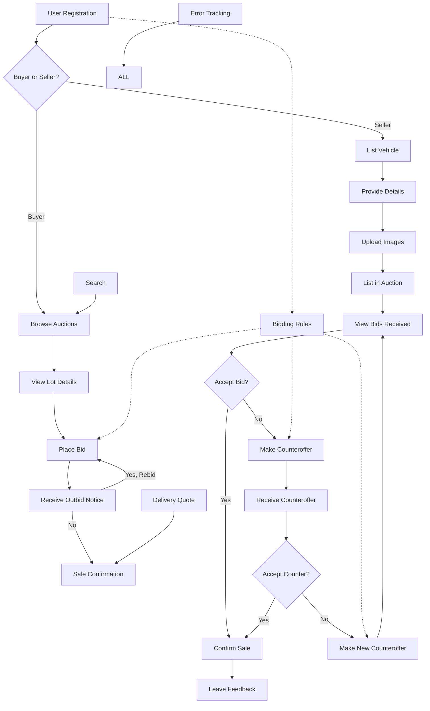

# 1. Setting Up Auction Lots

## 1.1 Customizing the Product Entity

In Medusa, the `Product` entity serves as the foundation for managing auction Lots. To empower administrators with dynamic attribute creation, follow these steps:

1. **Metadata**: Allow administrators to store additional data for Lots using the `metadata` attribute. This provides a flexible way to include auction-specific information. Administrators can add new attributes as needed, tailoring each Lot to their requirements.
    
    ```javascript
    metadata = {
      "auctionStartDate": "2023-09-15",
      "minimumBidAmount": 100,
      // Add more custom attributes as required
    }
    ```
    

## 1.2 Creating Options and Variants

In the context of your auction, each Lot may possess various attributes such as brand, model, and more. Enable administrators to represent these attributes as options and variants dynamically:

### Options

Empower administrators to create options for different Lot attributes, such as "Brand," "Model," "Color," etc. Achieve this by leveraging the `ProductOption` entity.

### Option Values

Facilitate the addition of specific attribute values within each option. For example, for the "Color" option, administrators can include values like "Blue," "Red," etc. Utilize the `ProductOptionValue` entity for this purpose.

### Variants

Enable administrators to construct variants for each Lot by combining option values. For instance, a Lot may feature variants like "Brand: Bentley," "Model: Mulsanne," "Color: Blue." The `ProductVariant` entity allows administrators to create new variants dynamically, adapting to the unique characteristics of each Lot.

# 2. Configuring Auction Lot Attributes

Now that administrators can dynamically add attributes to Lots, they can tailor attributes specific to each Lot seamlessly.

## 2.1 Auction-Specific Attributes

Administrators can configure auction-specific attributes such as "License Plate," "APK Expiry Date," "NAP Status," and others as part of the Lot's metadata. This dynamic configuration ensures that each Lot is accurately represented:

```javascript
metadata = {
  "licensePlate": true,
  "apkExpiryDate": "2025-10-01",
  "napStatus": "Logisch",
  // Add more custom attributes as required
}
```

## 2.2 Pricing and Bidding

Since you are utilizing prices as initial bids for Lots, administrators can configure the pricing dynamically for each Lot:

```javascript
prices = [
  {
    "currency_code": "USD",
    "amount": 10000, // $100.00
  },
  {
    "currency_code": "EUR",
    "amount": 8500, // €85.00
  },
  // Add more pricing options as needed
]
```

# 3. Displaying Auction Lots

When presenting Lots to customers on the storefront, administrators can specify the context, such as the customer's region or currency, dynamically. This dynamic context ensures that the correct pricing (initial bid amounts) is displayed for each customer, enhancing their shopping experience.

## Bid Increment Rules for Developers

In the context of auction functionality, administrators configure bid increment rules to dictate how bidding amounts progress during auctions. These rules establish a well-defined framework for bidding, ultimately elevating the overall auction experience. Here's a developer-centric breakdown of these rules:

## Initial Increment

At the commencement of the bidding process, administrators can set an initial increment. For instance, bids might initiate with an increment of £100 for values up to £2,000. This means that each time a bidder places a bid, it increases the current bid amount by £100.

## Intermediate Increment

Within a specific value range, e.g., values between £2,000 and £5,000, administrators can define an intermediate increment. This increment amount may differ from the initial increment. For example, bids within this range might increase by £200 for each bid placed.

## Advanced Increment

Beyond a certain threshold, such as surpassing £5,000, administrators have the flexibility to establish an advanced increment. This increment, which could be, for instance, £250, becomes effective when the bidding exceeds this threshold.

It's essential to emphasize that administrators can fine-tune these settings, introduce additional brackets for different value ranges, and specify precise increment amounts as necessary. The overarching goal is to optimize the bid structure, ensuring that bids progress in a manner that fosters competitive bidding among participants while upholding fairness and transparency in the auction process.

# 4. Dynamic Maximum Bid Configuration

In the realm of auction management, the dynamic configuration of maximum bids is pivotal for fostering a fair and controlled bidding environment. Here's an in-depth look at how administrators dynamically manage maximum bids:

**Setting a Limit**: Administrators wield the flexibility to establish a maximum bid amount for each lot. This figure represents the highest bid that a buyer can place on a specific lot. The dynamic nature of this setup empowers administrators to tailor these limits as necessary, taking into account the unique characteristics of each lot and the evolving dynamics of the auction.

_Example_: Imagine a rare collectible with an estimated value of $1,000. Administrators can dynamically set the maximum bid limit for this lot at $1,200 to ensure competitive bidding while preventing overextension.

**Progressive Adjustment**: Dynamic maximum bids serve as a critical safety net, preventing buyers from inadvertently overextending their budgets. Administrators can continuously fine-tune these limits, aligning them with the estimated value of each lot. This progressive adjustment ensures that bids consistently operate within a manageable and fiscally responsible range.

_Example_: As bidding for a valuable artwork progresses, administrators can dynamically increase the maximum bid limit to reflect its rising market value, allowing buyers to remain competitive without exceeding their predefined budget.

**Automated Bidding**: When competing bids reach or exceed a buyer's predefined maximum bid, automated bidding mechanisms spring into action. These systems dynamically place incremental bids on behalf of the buyer, striving to maintain their competitive edge up to their specified limit. This feature safeguards against buyers losing out on desirable lots due to last-minute manual bidding and permits real-time adjustments.

_Example_: If a buyer's maximum bid for a unique antique clock is $500, and another bidder places a $490 bid, the automated system will dynamically increase the buyer's bid to $500 to secure the lot, sparing them from manual intervention.

# 5. Bidding Process: A Structured and Transparent Approach

Admin's role in shaping the bidding process is crucial to fostering a fair and transparent environment for both buyers and sellers within the Medusa JS project. Here's a comprehensive explanation of how this process unfolds:

**Reserve Price: Setting the Floor**

Admin establishes a minimum threshold known as the "reserve price" for each lot. This reserve price serves as the absolute minimum amount that must be reached during bidding for a lot to be considered sold. If the highest bid does not meet or exceed this reserve price, an alert is automatically sent to the seller. At this point, the seller has a pivotal decision to make: they can choose to accept the highest bid or decline it, as it falls short of their predetermined reserve price.

**Counter Bidding: The Negotiation Dance**

Admin introduces a dynamic element into the bidding process known as "counter-bidding." This feature empowers both buyers and sellers to engage in negotiation to arrive at a final price that satisfies both parties. Here's how it unfolds:

1. **Seller Accepts, Declines, or Proposes a Counter Offer:** After receiving the highest bid, the seller has three options. They can choose to accept the highest bid immediately, signaling a straightforward sale. Alternatively, if the bid does not meet their expectations but shows promise, the seller can propose a counter offer, suggesting a higher price they're willing to accept. On the other hand, the seller can also decline the highest bid if it falls significantly below their desired price.
    
2. **Buyer's Response: Stay, Accept, or Counter Counter-Offer:** If the seller proposes a counter offer, the buyer receives it and faces three choices. They can decide to "stay," meaning they are content with the counter offer and accept it, finalizing the transaction. Alternatively, they may "accept" the counter offer without further negotiation. However, if the counter offer doesn't align with their budget or preferences, they can initiate a "counter counter-offer," suggesting a different price that they are willing to pay.
    
3. **Admin-Defined Interaction Limits:** Admin can establish predefined limits on the number of interactions allowed in the negotiation process. For instance, they may set a limit of two interactions for each party. This means that the seller and buyer have a maximum of two rounds of negotiation. After the second unsuccessful attempt by each party, further negotiations are automatically canceled.

# 6. Dynamic Sale Information Management

The dynamic configuration of sale-specific information by administrators is paramount for the seamless execution of auctions. It ensures that both buyers and sellers are equipped with up-to-the-minute details to engage effectively. Here's how administrators navigate the dynamic landscape of sale information management:

**Flexible Location**: Administrators possess the capability to dynamically specify the sale location, providing clarity regarding the precise venue for the auction event. This adaptability accommodates any location changes or the hosting of multiple auctions at different venues, ensuring accuracy in event information.

_Example_: In case of unexpected venue changes, administrators can dynamically update the sale location from "Main Hall" to "Grand Ballroom" to ensure participants reach the correct venue.

**Real-time Date and Time**: Administrators determine and adjust the auction's date and time, granting participants the ability to stay informed. The dynamic nature of this configuration permits real-time adjustments to accommodate scheduling changes, additional auction sessions, or unforeseen circumstances, ensuring participants have the latest information.

_Example_: If an auction session needs to be extended by 30 minutes due to high demand, administrators can dynamically update the date and time to reflect this extension, keeping participants informed and engaged.

**Dynamic Sale Naming**: Administrators assign distinctive and dynamic names to each auction, ensuring easy identification among multiple events. This dynamic naming convention empowers administrators to align the auction's name with its theme or purpose, making it more engaging and attractive to potential participants.

_Example_: For a charity auction, administrators can dynamically name the event "Art for a Cause," conveying its charitable nature and encouraging wider participation.

**Countdown Timers**: Dynamic countdown timers offer real-time insights into the time remaining until the auction's commencement. This feature equips participants with precise timing information, enabling them to plan their participation effectively, accounting for potential delays or schedule adjustments.

_Example_: A countdown timer dynamically adjusts to indicate the minutes and seconds remaining until the auction starts, allowing participants to join at the right moment.

# 7. Dynamic Delivery Quote System

Admin's implementation of a dynamic delivery quote system plays a crucial role in elevating the convenience and accessibility of the auction platform. Here's an in-depth explanation of how this system operates:

**Purpose**: The delivery quote system serves the primary purpose of offering buyers the option to request the delivery of items they have won in the auction, delivering them to a location of their choice. This dynamic feature enhances the overall auction experience.

**Plugin Integration**: Admin integrates a specialized delivery quote plugin into the platform. This plugin plays a pivotal role in calculating and presenting price ranges based on the specified delivery location. Buyers can conveniently estimate the cost associated with having their won items safely delivered to their preferred destination.

**Location-Based Pricing**: The delivery quote system is highly adaptable and location-sensitive. It takes into account the precise delivery destination provided by the buyer. By doing so, it ensures that the pricing is not only accurate but also tailored to the specific location, reflecting real-world delivery costs.

**Custom Pricing Options**: Additionally, the system offers a dynamic pricing model. Buyers can explore and select delivery options within the predefined price range. However, if a buyer's delivery requirements fall outside the custom price zone, they have the flexibility to request custom pricing. This feature accommodates unique delivery needs and fosters transparency in the pricing process.

# 8. Customized Alerts for Similar Vehicles

Admin's implementation of a robust alert system adds significant value for buyers with specific preferences and interests. Here's a comprehensive overview of how this dynamic alert system is managed:

**Alert Types**: Admin configures the alert system to provide buyers with a range of alert types, including options such as "Daily." Buyers have the freedom to choose their preferred alert type based on how frequently they wish to receive notifications.

**Matching Criteria**: Buyers are empowered to define precise criteria for the lots they are interested in. This can include specific vehicle models, brands, or other relevant attributes. The alert system dynamically monitors newly listed lots and compares them against the buyer's criteria. When there's a match, the system promptly sends notifications to the buyer.

**Customization**: Flexibility is a cornerstone of the alert system. Admin ensures that buyers can easily customize their alert preferences. This includes the ability to fine-tune their criteria, ensuring that they receive highly relevant notifications that align with their preferences.

**Notification Delivery**: The alert system is designed for seamless communication. It delivers notifications to buyers through their chosen communication channels, be it email, SMS, or other preferred methods. This ensures that buyers stay informed about new lots that match their criteria in real-time.

**Buyer Engagement**: Beyond convenience, the alert system actively encourages buyer engagement. By notifying buyers of relevant opportunities, it enhances their auction experience. Buyers are more likely to engage with the platform, participate in auctions, and make informed decisions, ultimately contributing to a vibrant and active auction community.

**Integration with ListMonk Campaign API**: It's important to note that enrolling a client in a specific ListMonk campaign is part of this alert system's functionality. Admin ensures that relevant data is sent to the ListMonk Campaign API, allowing seamless coordination between the auction platform and ListMonk's campaign management, facilitating effective communication with buyers via email campaigns. This integration enhances the reach and impact of the alert system, ensuring that buyers receive timely and engaging notifications.

# 9. Elevating User Registration and Authentication

## User Registration

### Seller Registration Example

**Personal Details**

* **First Name**: [First Name]
* **Surname**: [Surname]
* **Date of Birth**: [Date of Birth]
* **Phone Number**: [Phone Number]
* **Email**: [Email]

**Authentication Methods**

* **Sign-Up and Log-In Options**:
    * [ ]  Google
    * [ ]  Facebook
    * [ ]  Linkedin

## Enhanced Registration Features

### Vendor Registration

Vendors joining our platform are required to provide specific company information:

* **Company Name**: [Company Name]
* **Bank Account Number**: [Bank Account Number]
* **Residential Address**: [Place of Residence]
* **Postal Code**: [Postal Code]
* **Street Address**: [Street Name & House Number]
* **Government Approved ID**: [Upload ID]

### Buyer Registration

* **First Name**: [First Name]
* **Surname**: [Surname]
* **Date of Birth**: [Date of Birth]
* **Phone Number**: [Phone Number]
* **Email**: [Email]
* **Government Approved ID**: [Upload ID]

## Integration of Social Login

To enhance user convenience, we've seamlessly integrated social login options. Users can now register or log in using their existing social media accounts, including Google, Facebook, or Linkedin. This integration streamlines the registration process and ensures a smooth onboarding experience.

**Social Login Methods**:

* [ ]  Google
* [ ]  Facebook
* [ ]  Linkedin

### 5. How Did You Find Us?

Select the method through which you learned about Automotive Auctions. Choose from options like acquaintances, social media, Google, marketplace, previous purchase, BVA Auctions or other sources. Examplses created dynamically by Admin.

# Vehicle Registration Documentation

This documentation provides a comprehensive guide on how to register a vehicle as a seller on our platform. Sellers can use their registered accounts to add cars, make counteroffers, and manage their auction activities.

## 10. Vehicle Registration Documentation

This documentation provides a comprehensive guide on how to register a vehicle as a seller on our platform. Sellers can use their registered accounts to add cars, make counteroffers, and manage their auction activities.

## Registration Process

### 1. Create an Account

To begin, visit our registration page and create a seller account. During this step, you will need to provide the following required personal details:

- [ ] **First Name**
- [ ] **Surname**
- [ ] **Date of Birth**
- [ ] **Phone Number**
- [ ] **Email Address**

### 2. Choose Vehicle Offering Location

Select the location where you intend to offer your vehicle. You have several location options to choose from, such as:

- [ ] Boxmeer daily/exclusive cars & oldtimers
- [ ] Tiel daily/exclusive cars & oldtimers
- [ ] Boxmeer commercial vehicles

### 3. Legal Compliance

If you are auctioning with us for the first time or bringing a car from another owner, you must comply with legal regulations related to the prevention of money laundering and financing of terrorism (WWFT). You will be required to provide specific documents, which must originate from the owner of the vehicle being registered. For more information about WWFT legislation, refer to [this link](#).

### 4. Document Upload

During the registration process, you must upload the following documents:

- [ ] A copy of a valid government-issued ID of the vehicle owner.
- [ ] An (extract) copy of your Chamber of Commerce registration for a business sale.

## Vehicle Information

Provide detailed information about the vehicle you want to register:

- [ ] **Chassis Number**: Enter the vehicle's chassis number.
- [ ] **Brand**: Specify the vehicle's brand.
- [ ] **Model**: Provide the vehicle's model.
- [ ] **Type**: Describe the vehicle's type.
- [ ] **Date of First Admission**: Select the date when the vehicle was first admitted.
- [ ] **Counter Reading**: Enter the mileage on arrival at Automotive Auctions.
- [ ] **Unit Counter Reading**: Specify whether the mileage is in kilometers or miles.
- [ ] **Power in HP**: Indicate the vehicle's horsepower.
- [ ] **Drive**: Choose the drive type (front-wheel drive, rear-wheel drive, four-wheel drive).
- [ ] **Number of Seats**: Specify the number of seats in the vehicle.
- [ ] **Color**: Describe the vehicle's color.
- [ ] **Fuel**: Select the fuel type (petrol, diesel, electric, hybrid, hydrogen, gas).
- [ ] **Transmission**: Choose the transmission type (automatic, manual, semi-automatic).
- [ ] **Steering Wheel**: Specify whether the steering wheel is on the left or right side.
- [ ] **Engine Capacity**: Provide the engine capacity and number of cylinders.
- [ ] **Number of Doors**: Indicate the number of doors.
- [ ] **Number of Keys**: Specify the number of keys available.
- [ ] **Body**: Select the vehicle's body type (e.g., hatchback, sedan, SUV).
- [ ] **Certificate of Origin**: Indicate if the certificate of origin (CVO/COC) is present.
- [ ] **Maintenance History**: Specify the availability of maintenance history.
- [ ] **Nationality Documents**: Provide details about the vehicle's nationality documents.
- [ ] **Year of Construction**: Enter the year of construction.
- [ ] **Maintenance Invoices**: If available, include all invoices in the car for presentation.
- [ ] **VAT or Margin Vehicle**: Select the appropriate tax category (VAT or margin).
- [ ] **Damage History**: Indicate if the vehicle has a damage history.
- [ ] **Factory Warranty**: If applicable, specify the factory warranty status.
- [ ] **Engine Condition**: Describe the engine's condition.
- [ ] **Vehicle Starting**: Indicate whether the vehicle's engine starts.
- [ ] **Vehicle Options**: Select options that are present in the vehicle.
- [ ] **Additional Options/Accessories**: Provide information about additional options or accessories.
- [ ] **Additional Information**: Share any other relevant details about the vehicle.
- [ ] **Minimum Desired Yield**: Specify the minimum desired yield for the vehicle.

### Electric or Hybrid Vehicle (If Applicable)

If you are registering an electric or hybrid vehicle, please answer the following questions:

- [ ] **Battery Pack**: Confirm if the vehicle has the original battery pack since delivery.
- [ ] **Battery Error Messages**: Indicate if the car has ever shown error messages related to the battery pack.
- [ ] **Current Battery Error Messages**: Specify if the vehicle currently displays any error messages related to the battery pack.
- [ ] **Charging Cables/Adapters**: Confirm the presence of charging cables and/or adapters.

## Conditions

Before completing the registration, you must agree to the following conditions:

- [ ] The fuel tank must be at least 25% full at the time of intake.
- [ ] Acknowledge that after three auctions, the vehicle may be made available for sale elsewhere.

You may also have the option to upload any additional documents if required.

# 11. Auction Functionality Overview

Admin's role in configuring auction functionality is crucial for creating a smooth and efficient auction experience for developers and participants alike. Here's a breakdown of the key elements:

## Live Auction

### Presentation Order

Admin sets up the live auction feature to present lots one by one in a specific order during the auction event. This organized presentation allows participants to focus on individual items, enhancing the overall user experience.

## Inactivity Timeout

Admin defines an inactivity timeout, automatically closing lots if no bidding activity occurs within a specified timeframe. This feature ensures that auctions progress smoothly and do not stall due to inactivity, preventing delays and frustration.

## Image Upload

### File Service Plugin

Admin utilizes a file service plugin that enables sellers to upload images of their items. Images play a crucial role in helping buyers evaluate lots and make informed decisions. This feature enhances the visual representation of items and contributes to a more engaging auction experience.

## Search Functionality

### MeiliSearch Plugin

Admin implements a search feature using the MeiliSearch plugin. This empowers users to search for specific items or categories within the auction. The search functionality improves user navigation and helps participants find relevant lots quickly, enhancing their overall auction experience.

## Error Tracking

### Sentry Plugins

Admin deploys Sentry plugins for error tracking in both the frontend and backend. This proactive approach ensures that any issues or errors are promptly identified and addressed. By maintaining a smooth user experience and platform reliability, error tracking contributes to the trustworthiness of the auction platform.

Admin's meticulous management of these features and functionalities contributes to the overall success of the auction platform, making it user-friendly, efficient, and trustworthy for both developers and participants in the Medusa JS project.

Once you have completed the registration process, you will be able to log in to your account to add and manage your cars, make counteroffers, and participate in auctions.


